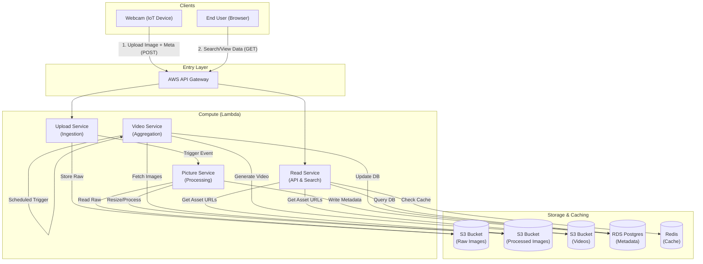

# The Weather Archive

A Serverless Cloud Computing Project for the University of Applied Sciences Technikum Wien.

## 1. Introduction and Goals

**The Weather Archive** is a cloud-native web application designed to collect, store, and visualize historical weather data. The system aggregates high-resolution images from webcams located in major European cities (Vienna, Berlin, Paris, London) along with meteorological metadata (temperature, humidity, air pressure).

**Key Features:**
*   **Historical Archive**: Long-term storage of weather imagery and data.
*   **Visualizations**: Time-lapse video generation and weather data plotting.
*   **Serverless Architecture**: Built entirely on AWS Serverless technologies for scalability and cost-efficiency.
*   **REST API**: Secure access for webcams (upload) and frontend clients (read).

## 2. Context and Scope

The system serves two primary user groups:
1.  **Webcams (Data Producers)**: Autonomous devices that capture and upload images/metadata every 5 minutes.
2.  **Users (Data Consumers)**: End-users accessing the web application to search for cities and view historical data visualizations.

**Scope:**
*   Ingestion of image and weather data via API.
*   Automated background processing (image compression, video stitching).
*   Data persistence (S3, RDS) and Caching (Redis).
*   Public-facing Web UI.

## 3. Solution Strategy

The solution leverages a **Serverless First** strategy on AWS to minimize operational overhead and handle variable traffic patterns efficiently.

*   **Infrastructure as Code (IaC)**: Terraform is used to provision all resources, ensuring reproducibility.
*   **Compute**: AWS Lambda for all business logic (API handlers, background tasks).
*   **Storage**:
    *   **Amazon S3**: Cheap, durable storage for raw images, processed images, and generated videos.
    *   **Amazon RDS (PostgreSQL)**: Structured relational database for image metadata, city information, and sensor readings.
*   **Caching**: Redis (Elasticache/Cloud) to optimize read performance for frequently accessed aggregations.
*   **Frontend**: A static Single Page Application (SPA) hosted on S3, communicating directly with the API Gateway.

## 4. Building Block View

The following diagram illustrates the high-level architecture and data flow.



### Component Details

*   **API Gateway**: The entry point for all HTTP requests. Routes requests to the appropriate Lambda function.
*   **Upload Service**: Authenticates webcams and handles initial data ingestion.
*   **Picture Service**: Asynchronously triggered. Resizes images for web display and extracts/stores metadata in RDS.
*   **Video Service**: Runs on a schedule. Compiles daily images into time-lapse videos for each city.
*   **Read Service**: Handles user queries. Checks Redis cache first; if a miss occurs, aggregates data from RDS/S3 and populates the cache.

## 5. Architecture Decisions

### 5.1 Serverless (AWS Lambda)
*   **Decision**: Use AWS Lambda instead of EC2/Containers.
*   **Justification**: Traffic is bursty (uploads every 5 mins) or sporadic (user visits). Lambda means we pay only for compute time used, with zero cost during idle periods.

### 5.2 Relation Database (PostgreSQL)
*   **Decision**: Use RDS PostgreSQL.
*   **Justification**: The data model (Cities, Images, Weather Data) is highly structured and relational. Complex queries (e.g., "average temperature per hour for City X on Date Y") are efficiently handled by SQL.

### 5.3 Caching (Redis)
*   **Decision**: Implement Redis caching.
*   **Justification**: Aggregation queries for plots can be expensive. Since historical weather data doesn't change once archived, it is a perfect candidate for caching to improve frontend responsiveness.

### 5.4 Video Generation Strategy
*   **Decision**: Scheduled daily generation.
*   **Justification**: Generating a video on-the-fly for every user request is computationally expensive and slow. Pre-generating daily summaries ensures instant playback for users.

## 6. Project Structure

```bash
.
├── terraform/              # Infrastructure as Code
│   ├── modules/            # Reusable Terraform modules (api, database, storage, etc.)
│   └── main.tf             # Root configuration
├── services/               # Backend Lambda Functions
│   ├── upload_service/
│   ├── read_service/
│   ├── picture_service/
│   └── video_service/
└── frontend/               # The Web Application
```

## 7. Setup & Deployment

### Prerequisites
*   AWS CLI configured
*   Terraform installed
*   Node.js installed

### Deploy Infrastructure
1.  Navigate to `terraform/`.
2.  Run `terraform init`.
3.  Run `terraform apply`.

### Frontend
The frontend is built with React/Vite (or similar, depending on implementation).
1. Navigate to `frontend/`.
2. `npm install`
3. `npm run dev` for local testing.
